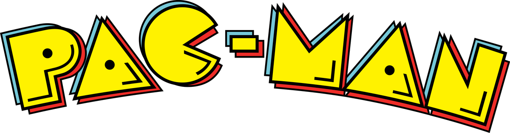

    
    <h3>Pac-Man with Pygame</h3>
    
A Pacman clone with original AI, created with Pygame.

## Introduction
Pac-Man, one of the most iconic video games of all time, was created by Toru Iwatani and developed by Namco (now Bandai Namco Entertainment). Released in Japan on May 22, 1980, and later in the United States in October 1980 by Midway, Pacman quickly became a cultural phenomenon and a cornerstone of the arcade gaming industry.